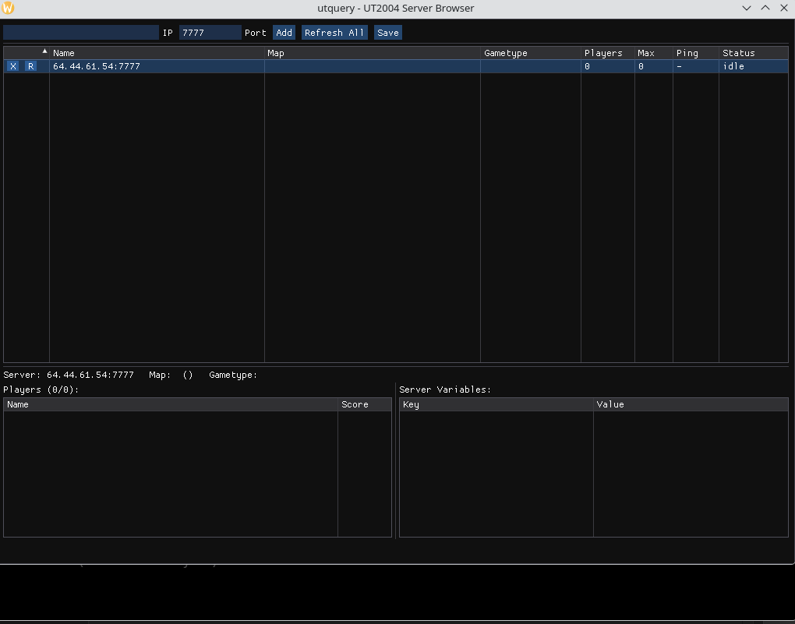

# UTQuery - UT2004 Server browser



## Running

### Linux
The app will read your installed key from `~/.ut2004/System/cdkey`, if not found will try to read from `cdkey` file.  Configuration is stored in `~/.utquery`

### Windows
The app will read your installed key, if not found will try to read from `cdkey` file. Configuration is stored in the application install folder.

### Command line options

```
Options:
  --help                Show this help message and exit
  --query <servers>     Query servers and output JSON to stdout
                        <servers> is a comma-separated list of host:port
                        If port is omitted, 7777 is assumed
  --file <path>         Write JSON output to a file instead of stdout
                        (used with --query)

Examples:
  utquery --query 192.168.1.1:7777,10.0.0.1,example.com:7778
  utquery --query myserver.com
  utquery --query myserver.com --file results.json

If no options are given, the GUI server browser is launched.
```

## Building

### Windows

Requires [vcpkg](https://github.com/microsoft/vcpkg) and CMake.

```
cmake --preset default
cmake --build build
```

### Linux

Requires CMake. Clone [vcpkg](https://github.com/microsoft/vcpkg) if you don't have it:

```
git clone https://github.com/microsoft/vcpkg.git
```

Then build:

```
cmake -B build --fresh -DCMAKE_TOOLCHAIN_FILE=src/vcpkg/scripts/buildsystems/vcpkg.cmake
cmake --build build
```

### Arch Linux (package install)

```
makepkg -si
```
